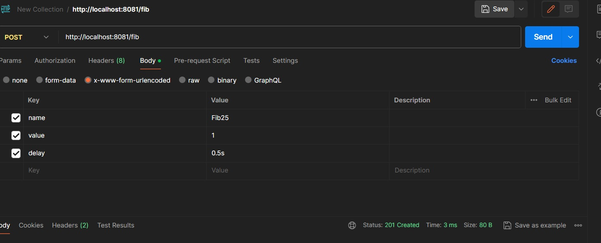
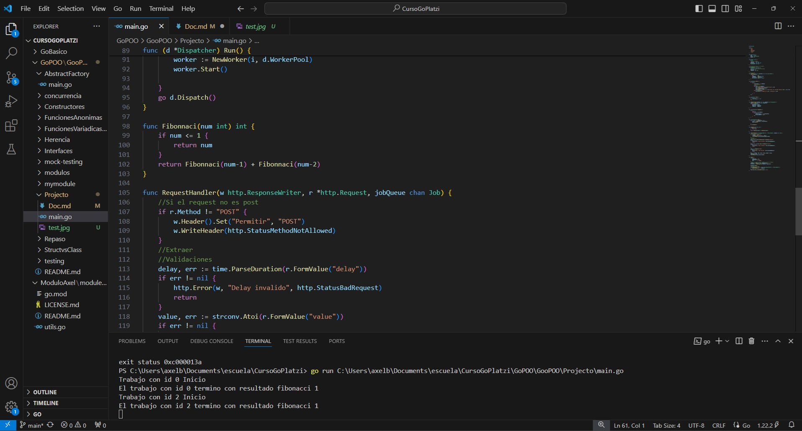

### I coded a WorkerPool where you can see concurrency by golang
I implemented concurrency with channels using the object-oriented programming paradigm. Additionally, I utilized Postman to test values on my application.

Test:

The results show that

